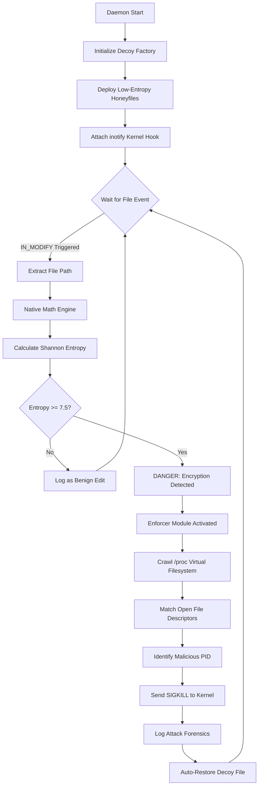

# Heuristic Ransomware Detection: An Active C++ Defense System


Traditional signature-based antivirus solutions consistently fail to detect zero-day ransomware. This project introduces a high-performance, mathematically driven Host-Based Intrusion Detection System (HIDS) written in native C++17, designed to stop active encryption in real-time. 

By deploying structured deception decoys (honeyfiles) and monitoring them through native Linux kernel event hooks, the system operates with near-zero resource overhead. Upon modification, the Heuristic Brain calculates the Shannon Entropy of the raw binary buffer. If the entropy breaches the cryptographic threshold (7.5+), the Enforcer module autonomously traces the active file descriptor through the `/proc` virtual filesystem, sends a `SIGKILL` to the malicious PID, logs the forensics, and automatically restores the compromised decoy.

## 🧠 System Architecture


⚙️ Core Enterprise Features
* **Kernel-Level Watchdog (`inotify`):** Bypasses high-level file wrappers to monitor directory events natively, resulting in **0% idle CPU usage**.
* **Mathematical Heuristics:** Utilizes Shannon Entropy to differentiate between benign text modifications and malicious cryptographic overwriting, eliminating **false positives**.
* **Native `/proc` Crawler:** Manually parses the Linux virtual filesystem to match active file descriptors to malicious PIDs without relying on external dependencies.
* **Automated Incident Response:** Features a persistent forensics logger (`hids_alerts.log`) and an **Auto-Restore** function to instantly rebuild compromised honeyfiles post-attack.

🚀 Compilation & Usage
1. Build the Native Daemon
Ensure you have g++ installed, then compile the core engine:

```Bash
g++ -std=c++17 src/main.cpp src/sentinel.cpp src/analyzer.cpp src/terminator.cpp -o hids_daemon
```

2. Deploy the HIDS
Run the compiled binary to deploy the decoys and arm the kernel hook:

```Bash
./hids_daemon
```

3. Simulate a Zero-Day Attack
In a separate terminal, inject cryptographic randomness into a deployed decoy to trigger the active defense mechanism:

```Bash
head -c 4096 /dev/urandom > decoys/admin_passwords.txt
```

📜 Disclaimer
This project was developed for academic research in Information Security and Privacy. The included testing scripts simulate ransomware behavior and should only be executed within isolated Virtual Machine environments.


Once that completes, run your Git commands to push the pristine file to GitHub:

```bash
git add README.md
git commit -m "Docs: Complete formatting overhaul of README with Mermaid Architecture"
git push
```
